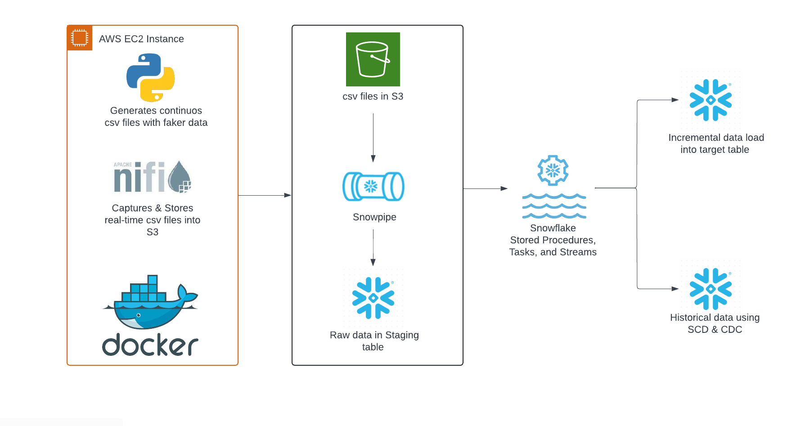

# NiFi-EC2-Docker-DataWarehousing-Snowflake

This project builds an architecture to capture and make use of real-time data streaming files. It automates the incremental data loading process and stores historical data in the Snowflake Data Warehouse.

## Required Tools
- **AWS EC2 instance**
- **Docker**
- **Snowflake**

### Business Requirement
The goal is to consume data from real-time streaming files, perform incremental data loads into a `customer` table, and store historical data in a `customer_history` table in Snowflake. If new data contains a `customer_id` not present in the `customer` table, it should be inserted as a new record. Otherwise, an update is performed, with the previous record moved to `customer_history` as historical data. Deleted records should also be stored in `customer_history`.

## Setting Up Infrastructure
1. **AWS EC2 Instance**: 
   - Launch an EC2 instance and connect via SSH.
   - Use Docker on the EC2 instance to manage containers for Jupyter Notebook and Apache NiFi.

2. **Docker Setup**:
   - Create a directory on EC2 to store a `docker-compose.yml` file, which defines containers for Jupyter Notebook and Apache NiFi.
   - Copy this directory from your local system to EC2.
   - Refer to [`docker_installation.sh`](./docker_installation.sh) to install Docker on EC2 and copy the `docker-compose.yml` directory.

3. **Docker Compose**:
   - Refer to [`docker-compose.yml`](./docker-compose.yml) for defining the containerized environment.
   - Set up Docker containers for Jupyter Notebook and Apache NiFi, specifying ports for each application.
   - Connect to Jupyter Notebook and NiFi using a browser at `http://<EC2-IP-ADDRESS>:<PORT>` (ports are specified in `docker-compose.yml`).

## Generating Faker Files
Since we do not have access to real-time streaming data, we'll use Python to generate fake data files:

1. **Faker CSV Files**:
   - Write Python scripts in Jupyter Notebook to create synthetic CSV files using the `faker` library.
   - Apache NiFi will access these files via a shared path provided in the `docker-compose.yml`.

2. **Apache NiFi Pipeline**:
   - Create a group of NiFi processors for handling files: `ListFile`, `FetchFile`, and `PutS3Object`.
   - Connect the processors to list, fetch, and place files into an S3 bucket.
   - Ensure proper configuration in NiFi for seamless file handling.

## Snowflake Setup
1. **Table Creation**:
   - Create three tables: `customer_raw`, `customer`, and `customer_history`.
   - `customer_raw` acts as a staging table for raw data.

2. **Snowflake File Format, Stage, Stream, and Snowpipe**:
   - Define file format, stage, stream, and Snowpipe in Snowflake.
   - Set up an S3 notification event to trigger Snowpipe upon new CSV file uploads. Snowpipe then loads data into `customer_raw`.

3. **Incremental and Historical Data Loading**:
   - Write SQL queries to incrementally load data into `customer` and move historical records to `customer_history`.
   - Develop a stored procedure to automate these tasks.

4. **Automation**:
   - Schedule the stored procedure using a Snowflake Task for continuous operation.
   - Refer to [`nifi_table_creations.sql`](./nifi_table_creations.sql), [`nifi_stored_procedure.sql`](./nifi_stored_procedure.sql), and [`nifi_analysis.sql`](./nifi_analysis.sql) for SQL code and detailed explanations.

## File References
- **[`docker_installation.sh`](./docker_installation.sh)**: Script to install Docker and prepare EC2 for Docker containers.
- **[`docker-compose.yml`](./docker-compose.yml)**: Docker Compose file to set up containers for Jupyter Notebook and Apache NiFi.
- **[`nifi_table_creations.sql`](./nifi_table_creations.sql)**: SQL script for creating tables in Snowflake.
- **[`nifi_stored_procedure.sql`](./nifi_stored_procedure.sql)**: SQL script for the stored procedure handling incremental and historical data loading.
- **[`nifi_analysis.sql`](./nifi_analysis.sql)**: SQL script for data analysis and queries.
